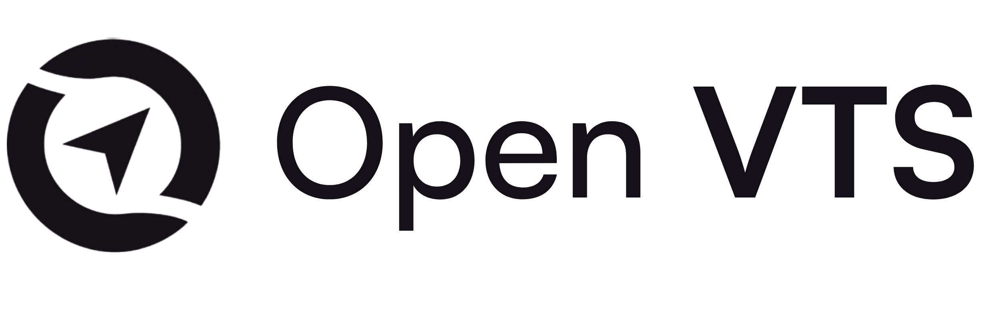

<p align="center">
  
</p>

# Open VTS — Mobile Application

[Website](https://openvts.io) · [Repository](https://github.com/openvts-code/openvts-application) · [License: MIT](LICENSE)

Open VTS is the open-source mobile application code for the Open VTS GPS tracking platform. This repository contains the Flutter-based mobile client (Android, iOS, Web) used for fleet tracking, live telemetry, geofencing, notifications and administrative workflows.

This README gives a concise, enterprise-ready introduction and step-by-step initialization instructions for developers and engineering teams.

**Key capabilities**

- Live map & telemetry (vehicle position, history)
- Multi-role UX: Superadmin / Admin / User
- Push notifications (FCM) and local notifications
- Geofencing, alerts, events and activity logs
- Route optimisation and planning tools
- Modular architecture, reusable UI components
- Offline cache / token storage and secure API client
- Unit & widget tests, CI-friendly layout

## Architecture Overview

- Client: Flutter (single codebase for Android, iOS, Web)
- State: Riverpod
- Networking: Dio (central ApiClient) + interceptors (auth, refresh)
- Routing: GoRouter with role-based shells
- Storage: local cache / secure token storage
- Realtime: Socket / telemetry pipeline (pluggable)

## Quickstart — Initialize & Run (Mobile)

Prerequisites

- Install Flutter (stable channel) — https://docs.flutter.dev/get-started/install
- Android SDK (Android Studio) for Android builds
- Xcode for iOS builds (macOS only)
- Git (to clone the repo)

Clone the repository

```bash
git clone https://github.com/openvts-code/openvts-application.git
cd openvts-application
```

Environment configuration

This project includes `.env.example` as a local reference — the `.env` file is not bundled into builds and is intended for local development only.

```bash
# macOS / Linux
cp .env.example .env

# Windows (PowerShell)
Copy-Item .env.example .env
```

Open `.env` and set the minimal values:

```env
API_BASE_URL=https://app.openvts.io/api
USE_MOCK_DATA=true
```

Notes:

- `USE_MOCK_DATA=true` enables mock-mode so the app runs without a backend — useful for initial evaluation.
- To run against a local backend from an Android emulator, set `API_BASE_URL` to `http://10.0.2.2:3000/api` (Android emulator host). For iOS Simulator use `http://localhost:3000/api`.

Install dependencies and run

```bash
flutter pub get

# Run on Chrome (web)
flutter run -d chrome --dart-define=USE_MOCK_DATA=true

# Run on a connected Android device or emulator (replace <device-id> as needed)
flutter run -d <device-id> \
  --dart-define=API_BASE_URL=http://localhost:3000/api \
  --dart-define=USE_MOCK_DATA=false
```

Release builds

```bash
# Android (APK)
flutter build apk --release

# iOS (requires Xcode signing, macOS)
flutter build ipa --export-options-plist=ios/ExportOptions.plist
```

Testing & analysis

```bash
flutter analyze
flutter test
flutter format .
```

## Running against production or staging

- Set `USE_MOCK_DATA=false` and point `API_BASE_URL` to your backend.
- Ensure secure storage and correct OAuth/refresh-token configuration before releasing.

## Enterprise guidance

- Use HTTPS/TLS for all backend endpoints and enforce certificate pinning where appropriate.
- Integrate single sign-on (SAML / OAuth2) at the backend and mirror role claims to the mobile client.
- Automate builds using CI (GitHub Actions recommended) with matrixed Flutter versions and emulator/device tests.
- Partition telemetry ingestion (Socket/Streaming) from the public API for scale and resilience.

## Contributing

- Please read [CONTRIBUTING.md](CONTRIBUTING.md) (if present) and open issues/PRs against this repository.
- Keep PRs small and focused; include tests for any logic changes.

## Support & links

- Project website: https://openvts.io
- Repository: https://github.com/openvts-code/openvts-application
- License: MIT (see `LICENSE`)

---

If you want, I can also:

- add a polished `CONTRIBUTING.md` and `CODE_OF_CONDUCT.md` template
- add a GitHub Actions workflow for Flutter CI
- add a higher-resolution logo or screenshots to `docs/` and embed them in this README

Tell me which of the above you'd like next.
